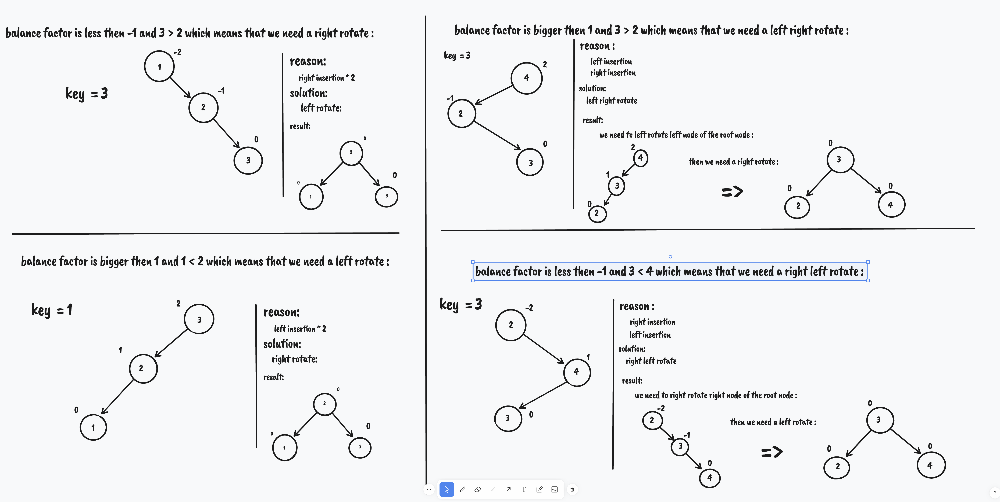

# ft_containers

ft_containers Is 42 Project
It Is All About Implementing Containers Of Cpp **Vector** **Stack** **Map** And **Set**
And Some Tools That Those Containers use like : **Equal** **Enable_if** ...

## first container with us is vector :

[What Is a Vector ? ](https://cplusplus.com/reference/vector/vector/)

**To implement vector you will need an array to store its's elements**

## second container with us is stack :

[What Is a stack ? ](https://cplusplus.com/reference/stack/stack/)

**To implement stack you will use it's underlaying container to store stack elements
and all of stack member function based on it's underlaying container . So if if you call for example size() function in stack it will call size()
function in it's underlaying container**

## third container with us is map :

[What Is a map ? ](https://cplusplus.com/reference/map/map/)

**to implement map you use something called binary search tree  [What Is a Binary Search Tree ? ](https://en.wikipedia.org/wiki/Binary_search_tree)
when you use bst you face timing problem your map will be to slow so to fix this probleme you need to use An Avl Tree [What Is a Avl Tree ? ](https://en.wikipedia.org/wiki/AVL_tree)**

## exmaple of Avl Tree Rotations :

## fourth container with us is set :

**to implement set you will use something called Red Black tree [What Is a Red Black Tree ? ](https://en.wikipedia.org/wiki/Red%E2%80%93black_tree) **

## example of Red Black Tree :

